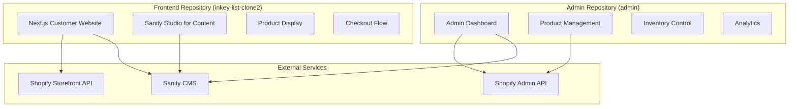

# 🚀 Dual Repository Deployment Guide
## Frontend (inkey-list-clone2) + Admin Dashboard (admin)

## 🎯 Architecture Overview



## 📋 Repository Responsibilities

### 🌐 Frontend (inkey-list-clone2)
- **Purpose**: Customer-facing e-commerce website
- **Content**: Product display, checkout, content pages
- **APIs**: Shopify Storefront API (read-only), Sanity CMS
- **Deployment**: Vercel (primary domain)
- **Includes**: Sanity Studio for visual content editing

### 🎛️ Admin (admin)
- **Purpose**: Internal product and content management
- **Content**: Product CRUD, inventory, analytics, admin tools
- **APIs**: Shopify Admin API (full access), Sanity CMS
- **Deployment**: Vercel (separate project, internal URL)
- **Access**: Internal team only

## 🔐 Environment Variables Setup

### Frontend Repository (.env.local)
```bash
# Shopify Storefront (Read-Only)
NEXT_PUBLIC_SHOPIFY_DOMAIN=your-shop.myshopify.com
NEXT_PUBLIC_SHOPIFY_STOREFRONT_ACCESS_TOKEN=your-storefront-token

# Sanity CMS (Content Management)
NEXT_PUBLIC_SANITY_PROJECT_ID=zqetc89y
NEXT_PUBLIC_SANITY_DATASET=production
SANITY_API_TOKEN=your-sanity-token

# Admin Dashboard Connection
NEXT_PUBLIC_ADMIN_API_URL=https://inkey-admin.vercel.app/api

# Preview and Visual Editing
SANITY_PREVIEW_SECRET=your-preview-secret
SANITY_WEBHOOK_SECRET=your-webhook-secret

# Site Configuration
NEXT_PUBLIC_SITE_URL=https://inkeylist.com
```

### Admin Repository (.env.local)
```bash
# Shopify Admin (Full Access)
SHOPIFY_ADMIN_ACCESS_TOKEN=your-admin-token
SHOPIFY_SHOP_DOMAIN=your-shop.myshopify.com
SHOPIFY_API_VERSION=2024-01

# Sanity CMS (Content Management)
NEXT_PUBLIC_SANITY_PROJECT_ID=zqetc89y
NEXT_PUBLIC_SANITY_DATASET=production
SANITY_API_TOKEN=your-sanity-token

# Frontend Connection
NEXT_PUBLIC_FRONTEND_URL=https://inkeylist.com

# Admin Configuration
ADMIN_TOKEN=your-admin-token
NEXT_PUBLIC_ADMIN_NAME=INKEY List Admin

# Webhook Configuration
SANITY_WEBHOOK_SECRET=your-webhook-secret
```

## 🚀 Deployment Steps

### Step 1: Deploy Admin Dashboard

1. **Connect Admin Repository to Vercel**
   ```bash
   # In your admin repository
   vercel --prod
   # Or connect via Vercel dashboard
   ```

2. **Configure Admin Environment Variables**
   - Go to Vercel Dashboard → Your admin project → Settings → Environment Variables
   - Add all admin environment variables listed above
   - Set for Production, Preview, and Development

3. **Set Custom Domain (Optional)**
   ```
   Custom domain: admin.inkeylist.com
   Or use Vercel URL: inkey-admin.vercel.app
   ```

### Step 2: Deploy Sanity Studio

1. **Deploy Studio from Admin Repository**
   ```bash
   cd admin/sanity-studio
   npx sanity login
   npx sanity deploy
   # Choose hostname: inkey-list-studio
   ```

2. **Configure CORS in Sanity**
   - Go to https://sanity.io/manage/personal/project/zqetc89y
   - Add both domains to CORS origins:
     - `https://inkeylist.com`
     - `https://inkey-admin.vercel.app`
     - `http://localhost:3000` (development)

### Step 3: Deploy Frontend Website

1. **Connect Frontend Repository to Vercel**
   ```bash
   # In your inkey-list-clone2 repository
   vercel --prod
   ```

2. **Configure Frontend Environment Variables**
   - Add all frontend environment variables
   - Ensure admin API URL points to deployed admin dashboard

3. **Set Production Domain**
   ```
   Production domain: inkeylist.com (or your chosen domain)
   ```

### Step 4: Configure Webhooks

1. **Sanity Webhooks** (for content updates)
   ```
   Frontend webhook: https://inkeylist.com/api/sanity/webhook
   Admin webhook: https://inkey-admin.vercel.app/api/sanity/webhook
   ```

2. **Shopify Webhooks** (for product/order updates)
   ```
   Admin webhook: https://inkey-admin.vercel.app/api/shopify/webhook
   Frontend webhook: https://inkeylist.com/api/shopify/webhook
   ```

## 🔗 Integration Flow

### Content Management Flow
```
Content Editor → Sanity Studio → Sanity CMS → Frontend Website
                                      ↓
                              Admin Dashboard (monitoring)
```

### Product Management Flow
```
Admin User → Admin Dashboard → Shopify Admin API → Shopify
                                      ↓
                              Frontend Website (via Storefront API)
```

### Customer Journey Flow
```
Customer → Frontend Website → Shopify Storefront API → Checkout
                ↓
         Sanity CMS (content)
```

## 📁 Frontend Repository Structure (inkey-list-clone2)

Create these essential files in your frontend repository:

### 1. API Integration (`lib/admin-api.ts`)
```typescript
// Connect to your deployed admin dashboard
const ADMIN_API_URL = process.env.NEXT_PUBLIC_ADMIN_API_URL;

export async function getProductsFromAdmin() {
  const response = await fetch(`${ADMIN_API_URL}/products`);
  return response.json();
}

export async function getProductFromAdmin(id: string) {
  const response = await fetch(`${ADMIN_API_URL}/products/${id}`);
  return response.json();
}
```

### 2. Sanity Integration (`lib/sanity.ts`)
```typescript
// Use the same Sanity configuration as admin
import { createClient } from '@sanity/client';

export const sanityClient = createClient({
  projectId: process.env.NEXT_PUBLIC_SANITY_PROJECT_ID!,
  dataset: process.env.NEXT_PUBLIC_SANITY_DATASET!,
  apiVersion: '2024-01-01',
  useCdn: true,
});
```

### 3. Homepage with Content (`pages/index.tsx`)
```typescript
import { sanityClient } from '@/lib/sanity';
import { getProductsFromAdmin } from '@/lib/admin-api';

export default function HomePage({ content, products }) {
  return (
    <div>
      {/* Hero section from Sanity */}
      <HeroSection content={content.heroSection} />

      {/* Featured products from Admin API */}
      <FeaturedProducts products={products} />

      {/* Content sections from Sanity */}
      <ContentSections sections={content.contentSections} />
    </div>
  );
}

export async function getStaticProps() {
  // Get content from Sanity
  const content = await sanityClient.fetch(`
    *[_type == "homepage"][0] {
      heroSection,
      featuredProductHandles,
      contentSections
    }
  `);

  // Get featured products from admin
  const productHandles = content.featuredProductHandles || [];
  const products = await Promise.all(
    productHandles.map(handle => getProductFromAdmin(handle))
  );

  return {
    props: { content, products },
    revalidate: 60
  };
}
```

## 🎨 Visual Editing Setup

### 1. Enable Visual Editing in Frontend
```typescript
// components/VisualEditing.tsx
import { enableOverlays } from '@sanity/visual-editing';

export function VisualEditing() {
  useEffect(() => {
    if (process.env.NODE_ENV === 'development' ||
        new URLSearchParams(window.location.search).has('preview')) {
      enableOverlays({
        zIndex: 999999,
      });
    }
  }, []);

  return null;
}
```

### 2. Add Visual Editing to Layout
```typescript
// app/layout.tsx
import { VisualEditing } from '@/components/VisualEditing';

export default function RootLayout({ children }) {
  return (
    <html>
      <body>
        {children}
        <VisualEditing />
      </body>
    </html>
  );
}
```

## 🔧 Testing the Integration

### 1. Test Content Flow
1. Edit content in Sanity Studio
2. Verify changes appear on frontend
3. Check admin dashboard shows content status

### 2. Test Product Flow
1. Create/edit product in admin dashboard
2. Verify product syncs to Shopify
3. Check product appears on frontend

### 3. Test Checkout Flow
1. Add product to cart on frontend
2. Proceed through Shopify checkout
3. Verify order appears in admin analytics

## 📊 Monitoring & Analytics

### Admin Dashboard URLs
- **Admin Dashboard**: `https://inkey-admin.vercel.app`
- **Sanity Studio**: `https://inkey-list-studio.sanity.studio`
- **Frontend**: `https://inkeylist.com`

### Health Checks
```typescript
// Monitor integration health
GET /api/health/sanity     // Sanity connection
GET /api/health/shopify    // Shopify connection
GET /api/health/admin      // Admin API connection
```

## 🚨 Troubleshooting

### Common Issues

1. **CORS Errors**
   - Add all domains to Sanity CORS settings
   - Verify environment variables are set

2. **API Connection Failures**
   - Check environment variables in both projects
   - Verify webhook URLs are accessible

3. **Content Not Updating**
   - Check Sanity webhook configuration
   - Verify ISR revalidation is working

4. **Products Not Syncing**
   - Check Shopify API credentials
   - Verify admin API endpoints

### Debug Commands
```bash
# Check Sanity connection
curl https://inkeylist.com/api/sanity/status

# Check admin API
curl https://inkey-admin.vercel.app/api/health

# Check Shopify sync
curl https://inkey-admin.vercel.app/api/shopify/status
```

## 🎯 Success Checklist

- [ ] Admin dashboard deployed and accessible
- [ ] Sanity Studio deployed and functioning
- [ ] Frontend website deployed with content
- [ ] Product management working in admin
- [ ] Content editing working in Sanity Studio
- [ ] Shopify checkout functioning
- [ ] Webhooks configured and firing
- [ ] Visual editing enabled on frontend
- [ ] Both domains secured with SSL
- [ ] Environment variables configured

## 📞 Support Resources

- **Vercel Documentation**: https://vercel.com/docs
- **Sanity Documentation**: https://sanity.io/docs
- **Shopify API**: https://shopify.dev/docs
- **Next.js Documentation**: https://nextjs.org/docs

Your dual-repository architecture is now ready for production! 🚀
