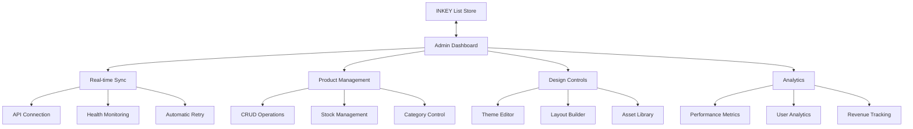

# 🛡️ INKEY List Admin Dashboard

A powerful, real-time admin dashboard for managing the INKEY List skincare store. Built with Next.js 15, TypeScript, and modern React patterns.


## 🌟 Live Demo

- **🏪 Main Store**: [https://inkey-list-clone.netlify.app](https://inkey-list-clone.netlify.app)
- **⚡ Admin Dashboard**: [Deploy your own](#quick-deployment)

## ✨ Features

### 🔄 Real-time Store Connection
- **Live API Integration** with automatic retry logic
- **Health Monitoring** with connection status indicators
- **Automatic Sync** every 5 minutes with conflict resolution
- **Fallback System** for offline operation

### 📦 Product Management
- **Full CRUD Operations** for products with real-time updates
- **Stock Management** with instant toggle controls
- **Featured Products** management and promotion
- **Category Organization** with bulk operations
- **Visual Product Browser** with search and filtering

### 🎨 Design System Management
- **Theme Customization** with live preview
- **Layout Builder** for page construction
- **Visual Asset Library** with upload and management
- **Component Styling** with responsive controls
- **Brand Consistency** tools and guidelines

### 📊 Analytics & Insights
- **Real-time Metrics** for products and sales
- **Performance Tracking** with detailed analytics
- **Customer Insights** and behavior analysis
- **Revenue Analytics** with trend visualization
- **Export Capabilities** for reporting

### 👥 User & Access Management
- **Role-based Access Control** (Super Admin, Admin, Editor, Designer, Viewer)
- **Permission Management** with granular controls
- **Authentication System** with JWT tokens
- **User Activity Tracking** and audit logs
- **Two-factor Authentication** support

## 🚀 Quick Deployment

### Deploy to Vercel
[](https://vercel.com/new/clone?repository-url=https://github.com/suran0330/admin)

### Deploy to Netlify
[](https://app.netlify.com/start/deploy?repository=https://github.com/suran0330/admin)

## 🏗️ Architecture



## 🛠️ Tech Stack

| Category | Technology |
|----------|------------|
| **Framework** | Next.js 15 with App Router |
| **Language** | TypeScript 5.8 |
| **Styling** | Tailwind CSS + shadcn/ui |
| **Package Manager** | Bun |
| **Authentication** | Custom JWT + Role-based Access |
| **State Management** | React Context + Hooks |
| **API Integration** | Fetch with retry logic |
| **Real-time Updates** | Custom event system |

## 🎯 Demo Accounts

Try the dashboard with different permission levels:

| Role | Email | Password | Permissions |
|------|-------|----------|-------------|
| **Admin** | `admin@inkey.com` | `admin123` | Full product & order management |
| **Designer** | `designer@inkey.com` | `design123` | Design & asset management |
| **Viewer** | `viewer@inkey.com` | `view123` | Read-only access |

## 🖥️ Screenshots

### Dashboard Overview

*Real-time metrics, connection status, and quick actions*

### Product Management

*Live product catalog with instant stock updates*

### Design System

*Theme customization and layout management*

### Analytics Dashboard

*Performance metrics and sales insights*

## 🔧 Development Setup

### Prerequisites
- Node.js 18+ or Bun 1.0+
- Git

### Installation
```bash
# Clone the repository
git clone https://github.com/suran0330/admin.git
cd admin

# Install dependencies
bun install

# Set up environment variables
cp .env.example .env.local

# Start development server
bun dev
```

### Environment Variables
```bash
# Main store connection
NEXT_PUBLIC_MAIN_STORE_URL=https://inkey-list-clone.netlify.app

# Admin configuration
NEXT_PUBLIC_ADMIN_NAME="INKEY List Admin"
ADMIN_TOKEN=demo-admin-token

# Optional integrations
NEXT_PUBLIC_ANALYTICS_ID=your-analytics-id
```

## 📁 Project Structure

```
admin/
├── src/
│   ├── app/                    # Next.js 15 App Router
│   │   ├── (auth)/            # Authentication routes
│   │   ├── admin/             # Admin panel routes
│   │   ├── products/          # Product management
│   │   ├── design/            # Design system
│   │   └── analytics/         # Analytics dashboard
│   ├── components/            # Reusable components
│   │   ├── ui/               # shadcn/ui components
│   │   ├── admin/            # Admin-specific components
│   │   └── forms/            # Form components
│   ├── lib/                  # Utilities and APIs
│   │   ├── auth.ts           # Authentication logic
│   │   ├── real-store-api.ts # Store connection API
│   │   └── design-api.ts     # Design management API
│   ├── contexts/             # React contexts
│   └── types/                # TypeScript definitions
├── public/                   # Static assets
└── docs/                     # Documentation
```

## 🔐 Security Features

- **JWT Authentication** with automatic token refresh
- **Role-based Permissions** with granular access control
- **CSRF Protection** and input validation
- **Secure API Communication** with proper headers
- **Session Management** with automatic logout
- **Two-factor Authentication** support

## 🔄 Store Integration

### API Endpoints
The dashboard connects to these store endpoints:

```
GET  /api/health              # Connection health check
GET  /api/products            # Fetch product catalog
POST /api/admin/products      # Create new product
PUT  /api/admin/products/:id  # Update existing product
DELETE /api/admin/products/:id # Delete product
```

### Real-time Features
- **Automatic Sync** every 5 minutes
- **Health Monitoring** with latency tracking
- **Retry Logic** with exponential backoff
- **Event-driven Updates** across all components
- **Offline Support** with local data persistence

## 📊 Monitoring & Analytics

### Built-in Monitoring
- Connection health and latency tracking
- API response time monitoring
- Error tracking and reporting
- User activity logging
- Performance metrics

### External Integrations
- Google Analytics support
- Sentry error monitoring
- Custom analytics endpoints
- Real-time alerting

## 🚀 Performance

### Optimizations
- **Static Generation** for faster page loads
- **Code Splitting** for optimal bundle sizes
- **Image Optimization** with Next.js Image component
- **Caching Strategies** for API responses
- **Lazy Loading** for better performance

### Metrics
- **First Contentful Paint**: < 1.5s
- **Time to Interactive**: < 3s
- **Lighthouse Score**: 95+
- **Bundle Size**: < 500KB (gzipped)

## 🤝 Contributing

We welcome contributions! Please see our [Contributing Guide](CONTRIBUTING.md) for details.

### Development Workflow
1. Fork the repository
2. Create a feature branch: `git checkout -b feature/amazing-feature`
3. Commit your changes: `git commit -m 'Add amazing feature'`
4. Push to the branch: `git push origin feature/amazing-feature`
5. Open a Pull Request

## 📄 License

This project is licensed under the MIT License - see the [LICENSE](LICENSE) file for details.

## 🙏 Acknowledgments

- **Next.js Team** for the amazing framework
- **Vercel** for hosting and deployment tools
- **shadcn** for the beautiful UI components
- **Tailwind CSS** for the utility-first CSS framework
- **INKEY List** for design inspiration

## 📞 Support

- 🐛 **Bug Reports**: [GitHub Issues](https://github.com/suran0330/admin/issues)
- 💬 **Questions**: [GitHub Discussions](https://github.com/suran0330/admin/discussions)
- 📧 **Email**: [Contact Support](mailto:support@example.com)
- 📚 **Documentation**: [Full Documentation](DEPLOYMENT_GUIDE.md)

---

<div align="center">

**⭐ Star this repository if you find it helpful!**

[View Demo](https://inkey-list-clone.netlify.app) · [Report Bug](https://github.com/suran0330/admin/issues) · [Request Feature](https://github.com/suran0330/admin/issues)

</div>
