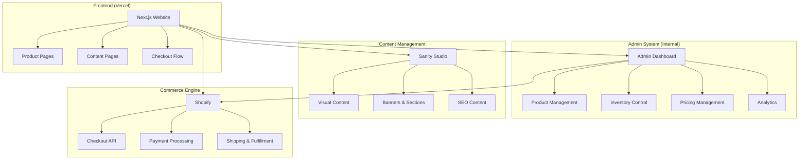

# 🏗️ System Architecture - INKEY List Platform

## 🎯 Three-Tier Architecture Overview



## 🔄 Data Flow & Integration Points

### **1. Product Management Flow**
```
Admin Dashboard → Internal Database → Next.js Frontend
                ↓
        Sync to Shopify (for checkout only)
```

### **2. Content Management Flow**
```
Sanity Studio → Content API → Next.js Frontend
```

### **3. Checkout Flow**
```
Next.js → Shopify Checkout API → Payment → Fulfillment
```

## 📊 System Responsibilities

### 🎛️ **Your Admin Dashboard**
**Primary Functions:**
- ✅ Product creation and editing
- ✅ Inventory management and tracking
- ✅ Pricing control and promotions
- ✅ Product categorization and tags
- ✅ Analytics and reporting
- ✅ User management and permissions

**Data Storage:**
- Product catalog with full details
- Inventory levels and tracking
- Pricing history and rules
- Customer analytics
- Order management (pre-checkout)

### 🎨 **Sanity CMS**
**Primary Functions:**
- ✅ Homepage content management
- ✅ Banner and promotional content
- ✅ Page layouts and sections
- ✅ SEO content and meta tags
- ✅ Visual content editing
- ✅ Multi-language content (if needed)

**Content Types:**
- Homepage sections
- Landing pages
- Banners and announcements
- About/Policy pages
- Blog content
- Navigation menus

### 🛒 **Shopify (Checkout Only)**
**Primary Functions:**
- ✅ Secure checkout process
- ✅ Payment processing
- ✅ Shipping calculations
- ✅ Order fulfillment
- ✅ Tax calculations
- ✅ Subscription management (if needed)

**Minimal Product Data:**
- Basic product info for checkout
- SKUs and variants
- Shipping weights/dimensions
- Tax categories

### 🌐 **Next.js Frontend**
**Primary Functions:**
- ✅ Product display from admin API
- ✅ Content rendering from Sanity
- ✅ Checkout integration with Shopify
- ✅ SEO optimization
- ✅ Performance optimization

## 🔌 API Integration Strategy

### **Admin Dashboard → Next.js**
```typescript
// Product API endpoints
GET /api/products              // List all products
GET /api/products/[id]         // Get product details
GET /api/products/category/[slug] // Products by category
GET /api/search?q=term         // Product search
GET /api/inventory/[sku]       // Real-time inventory
```

### **Sanity → Next.js**
```typescript
// Content API queries
const HOMEPAGE_QUERY = `*[_type == "homepage"][0]`
const BANNER_QUERY = `*[_type == "banner" && active == true]`
const PAGE_QUERY = `*[_type == "page" && slug.current == $slug][0]`
```

### **Next.js → Shopify**
```typescript
// Checkout API calls
POST /api/checkout/create      // Create checkout session
POST /api/checkout/add-item    // Add item to checkout
GET /api/shipping/calculate    // Calculate shipping
POST /api/payment/process      // Process payment
```

## 🔄 Data Synchronization

### **Admin → Shopify Sync**
```typescript
// Sync essential product data to Shopify for checkout
interface ShopifyProductSync {
  handle: string;
  title: string;
  price: number;
  sku: string;
  weight: number;
  taxable: boolean;
  inventory_quantity: number;
}

// Sync triggers:
// - Product creation/update in admin
// - Inventory changes
// - Price updates
// - Product activation/deactivation
```

### **Real-time Inventory Updates**
```typescript
// Webhook flow: Shopify → Admin when orders complete
POST /api/webhooks/shopify/order-paid
// Updates inventory in admin database
// Triggers revalidation of product pages
```

## 🏃‍♂️ Implementation Steps

### **Phase 1: Admin-Frontend Integration**
1. **Set up product API endpoints** in your admin
2. **Create Next.js API routes** to fetch from admin
3. **Build product display components** using admin data
4. **Implement search and filtering** from admin database
5. **Add real-time inventory checks**

### **Phase 2: Sanity Content Integration**
1. **Configure Sanity schemas** for content management
2. **Set up content API calls** in Next.js
3. **Build flexible content components**
4. **Implement visual editing** with live preview
5. **Add SEO optimization** from Sanity data

### **Phase 3: Shopify Checkout Integration**
1. **Create minimal product sync** to Shopify
2. **Build checkout flow** using Shopify APIs
3. **Implement payment processing**
4. **Set up order webhooks** for inventory updates
5. **Add shipping integrations**

## 📝 Code Structure Examples

### **Next.js API Route (Product Data)**
```typescript
// pages/api/products/[id].ts
export default async function handler(req, res) {
  const { id } = req.query;

  // Fetch from your admin API
  const product = await fetch(`${process.env.ADMIN_API_URL}/products/${id}`, {
    headers: {
      'Authorization': `Bearer ${process.env.ADMIN_API_TOKEN}`
    }
  }).then(res => res.json());

  // Combine with Sanity content if needed
  const contentData = await sanityClient.fetch(
    `*[_type == "productContent" && productId == $id][0]`,
    { id }
  );

  res.json({
    ...product,
    content: contentData
  });
}
```

### **Product Component (Next.js)**
```typescript
// components/ProductCard.tsx
interface Product {
  id: string;
  name: string;
  price: number;
  inventory: number;
  images: string[];
  // Data from your admin
}

export function ProductCard({ product }: { product: Product }) {
  const handleAddToCart = async () => {
    // Add to Shopify checkout
    await fetch('/api/checkout/add-item', {
      method: 'POST',
      body: JSON.stringify({
        shopifyVariantId: product.shopifyVariantId,
        quantity: 1
      })
    });
  };

  return (
    <div className="product-card">
      
      <h3>{product.name}</h3>
      <p>${product.price}</p>
      <p>{product.inventory > 0 ? 'In Stock' : 'Out of Stock'}</p>
      <button onClick={handleAddToCart}>Add to Cart</button>
    </div>
  );
}
```

### **Sanity Content Integration**
```typescript
// lib/sanity-queries.ts
export const HOMEPAGE_CONTENT = groq`
  *[_type == "homepage"][0] {
    heroSection {
      headline,
      subheadline,
      backgroundImage,
      ctaButton
    },
    featuredProductHandles,
    contentSections[] {
      _type,
      title,
      content,
      image,
      layout
    }
  }
`;

// pages/index.tsx
export async function getStaticProps() {
  const homepageContent = await sanityClient.fetch(HOMEPAGE_CONTENT);

  // Fetch featured products from your admin
  const featuredProducts = await Promise.all(
    homepageContent.featuredProductHandles.map(handle =>
      fetch(`${process.env.ADMIN_API_URL}/products/handle/${handle}`)
        .then(res => res.json())
    )
  );

  return {
    props: {
      content: homepageContent,
      featuredProducts
    },
    revalidate: 60 // ISR
  };
}
```

## 🔐 Security & Performance

### **API Security**
- Admin API: JWT tokens, rate limiting
- Sanity: Read-only tokens for frontend
- Shopify: Webhook signature verification

### **Performance Optimization**
- Next.js ISR for product pages
- Redis caching for inventory data
- CDN for Sanity images
- Shopify checkout prefetching

### **Data Consistency**
- Real-time inventory sync
- Webhook-based updates
- Fallback to admin API for critical data

## 🚀 Deployment Strategy

### **Admin Dashboard**
- Deploy to your preferred platform
- Ensure high availability for product API
- Set up monitoring and alerts

### **Next.js Frontend**
- Deploy to Vercel with ISR
- Configure environment variables
- Set up domain and SSL

### **Sanity Studio**
- Deploy studio to sanity.studio
- Configure CORS for your domain
- Set up webhook for cache invalidation

This architecture gives you complete control over your product data while leveraging Shopify's robust checkout infrastructure and Sanity's excellent content management capabilities.
